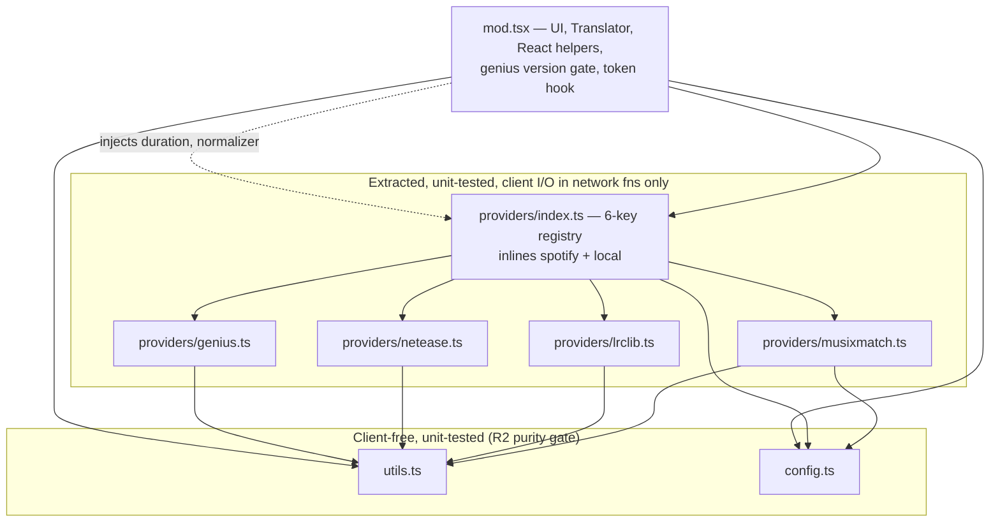

# refactor: Extract the lyrics-plus provider layer into testable modules

## Goal Capsule

**Objective.** Split the extractable logic out of `modules/lyrics-plus/mod.tsx` (5,710 lines) into its own files with top-level named exports and unit tests, so lyrics-plus moves toward the structure `modules/store/` already demonstrates.

**Authority hierarchy.** This plan > repo conventions in `docs/module-standard.md` > implementer judgment on details the plan leaves open. Where the plan and the standard disagree on **module structure or client isolation**, the standard wins and the conflict is reported. Filenames are not such a conflict: the standard's `logic.ts` names a role, and this plan realizes that role as `utils.ts`, `config.ts`, and `providers/*.ts` (KTD8).

**Stop conditions.** Stop and report rather than guessing when: an extraction would change lyrics behavior; a provider's real export surface differs from what U3 describes; or the U5 live check shows any provider regressing against the U6 baseline.

**Execution profile.** Behavior-preserving refactor of a file with no existing test coverage. Every unit is a verbatim move plus tests. The move order in KTD9 and the pre-captured baseline in U6 are what make "behavior-preserving" checkable rather than asserted.

**Tail ownership.** Caller-owned (LFG pipeline).

---

## Product Contract

### Summary

`modules/lyrics-plus/mod.tsx` is the classic extension's 15 source files concatenated into one, with the original filenames preserved as section-header comments. This plan lifts the provider layer, the pure utils core, and CONFIG into real files with tests, and leaves the UI sections and the translator in place.

### Problem Frame

Only 2 of 16 modules have any tests, and every module exports exactly one symbol (its default). For lyrics-plus, the provider parsers — the code most likely to break when an external lyrics API shifts — cannot be imported or tested at all, because they sit behind a single default export.

This is not primarily a file-length problem. `store` shows the shape that works: `store/catalog.ts` has 10 exports, 0 imports and 0 `Spicetify.` references, with client access isolated in `store/runtime.ts`. lyrics-plus is well-positioned to adopt it: 81 top-level declarations and documented section seams, so this is mostly moving code.

### Requirements

- **R1.** The four provider implementations, the providers registry, the utils core, and CONFIG live in their own files under `modules/lyrics-plus/`, each with top-level **named** exports.
- **R2.** `modules/lyrics-plus/utils.ts` and `modules/lyrics-plus/config.ts` contain zero `Spicetify.` references. Provider files confine client access to their network functions (`findLyrics` and, for Musixmatch, `getTranslation`); no provider file touches the client at module scope, so its test file can import it under `node --test`.
- **R3.** Unit tests cover the extracted pure logic — including the karaoke and translation parsers — and run under the repo's existing `node --test` harness via `nub run test`.
- **R4.** Behavior is unchanged, measured against the baseline captured in U6.
- **R5.** The built artifact stays a single bundled chunk — no packaging or install-semantics change.

### Success Criteria

- The seven extracted sections no longer appear in `mod.tsx`; the file drops by roughly 1,500 lines (informational — the binding gate is the section-removal check in U4, not a line count).
- `nub run test` passes. The 89-test baseline only grows.
- `grep -c "Spicetify\."` returns 0 for `utils.ts` and `config.ts`; every `Spicetify.` hit in a provider file sits inside `findLyrics` or `getTranslation`.
- `node scripts/stitch.ts modules/lyrics-plus` emits exactly one `index.js`.
- U5 clears its minimum bar against the U6 baseline: `spotify` plus at least two other providers verified, `local` verified.

### Scope Boundaries

**In scope.** `Utils` (`mod.tsx:226-551`), the four providers (`mod.tsx:722-1647`), the `Providers` registry (`mod.tsx:1650-1913`), and the `CONFIG` literal plus `getConfig` and its normalization block (`mod.tsx:40-223`).

#### Deferred to Follow-Up Work

- **`Translator` (`mod.tsx:554-719`).** Deliberately out of scope. It is not part of the approved provider slice, its testable surface is thin (it loads kuroshiro/kuromoji/aromanize/OpenCC from CDNs at runtime), and extracting it would drag `utils.ts` into depending on it via `toSimplifiedChinese`. KTD6 keeps that dependency in `mod.tsx` instead.
- **Hoisting the closure-nested modules.** `loopy-loop` (0 top-level declarations / 21 nested), `popup-lyrics` (0/30), `shuffle-plus` (0/27), `full-app-display` (1/32), `keyboard-shortcut` (2/16), `bookmark` (4/20), `trashbin` (5/19) each need their contents lifted out of the default export first. Sequenced after this slice so tests exist before that surgery.
- **Deduplicating lyrics-plus and popup-lyrics providers.** `popup-lyrics/mod.tsx` independently implements Musixmatch, Netease and LRCLIB (13 references). This extraction creates the seam that makes sharing possible; taking it now would widen a refactor into a cross-module redesign.
- **Splitting the lyrics-plus UI sections.** `Pages` (1,104 lines), `LyricsContainer` (1,154), `Settings` (765), `OptionsMenu` (469), `TabBar` (212). Provider ordering and the `service.on` filter live in `LyricsContainer.tryServices` (`mod.tsx:4729-4740`) and move with them, not with this slice.

**Non-goals.** No change to lyrics behavior, provider selection, translation output, or user-visible settings. In particular `getConfig`'s current quirks are pinned by tests, not corrected.

### Outstanding Questions

None blocking.

### Sources

- `modules/store/catalog.ts` / `runtime.ts` — the target shape: pure core plus an explicit client seam.
- `modules/manager/state.test.mts` — the test pattern: colocated `.test.mts` importing the `.ts` directly.
- `modules/stdlib/lib/test-setup.mts` — the happy-dom harness. Copies a fixed list of 15 globals; `localStorage` is **not** among them (see U1).
- `packages/kit/src/build.ts:91-92` — the `mod.ts` public-barrel behavior behind KTD8, and the single-entry `codeSplitting: false` path that guarantees R5.
- `modules/lyrics-plus/mod.tsx` — extraction targets: `CONFIG` at `:67` with normalization at `:141-190`; `Utils` `:226-551`; providers `:722-1647`; registry `:1650-1913`. Client couplings to preserve: `Spicetify.Platform.version` via `spotifyVersion` (`:24`, applied at `:127`), the `parseLocalLyrics` duration read (`:533`), and `useMusixmatchTokenValid` (`:735-736`).

---

## Planning Contract

### Key Technical Decisions

- **KTD1. First slice is the lyrics-plus provider layer, not the closure-nested modules.** _(session-settled: user-approved — chosen over starting with `shuffle-plus` to prove the hoisting pattern: it is the largest clean win, needs no closure hoisting, and covers the code most likely to break when an external lyrics API shifts.)_

- **KTD2. Tests land in the same change as the extraction, not a follow-up.** _(session-settled: user-approved — chosen over splitting files now and testing later: `store` already demonstrates that structure alone does not produce tests — 9 files, 0 tests.)_

- **KTD3. Hoisting the seven closure-nested modules is deferred to a later phase.** _(session-settled: user-approved — chosen over hoisting everything now: it is invasive and there are no tests yet to catch a regression.)_

- **KTD4. `CONFIG` moves to `config.ts` and is imported as a shared mutable singleton, but its client-dependent gate does not move.** CONFIG is referenced 134 times and is mutated at runtime (`CONFIG.providers.musixmatch.token = token`), so one imported module-level object preserves identity and mutation exactly. The `genius.on` entry, however, is computed from `spotifyVersion` (`Spicetify.Platform.version`, `mod.tsx:24`, applied at `:127`). That version override **stays in `mod.tsx`**, which already re-applies it at `:2509`, `:3017` and `:4734`. Without this split, importing `config.ts` under `node --test` throws before any assertion runs.

- **KTD5a. LRCLIB keeps the _playing_ track's duration, not `info.duration`.** Found during U1/U2 review. `componentDidMount` prefetches the **next** track through `tryServices(nextInfo, …)` (`mod.tsx:4877`), so having the registry pass `info.duration` into LRCLIB would hand it the next track's duration where the original used the playing track's. U4 must therefore pass the same `currentTrackDurationMs()` helper `mod.tsx` already uses, not `info.duration`. This supersedes the registry-threading half of KTD5. The blast radius is only the karaoke end-time fallback, and U5 would very likely not catch it.

- **KTD5. Pure logic receives client values as parameters, threaded through every call site.** `parseLocalLyrics` reads `Spicetify.Player.data.item.metadata.duration` as a karaoke end-time fallback (`mod.tsx:533`). It gains an explicit duration parameter. It has **three** call sites, not one: `mod.tsx:5202`, plus `ProviderLRCLIB.getUnsynced` (`:1283`) and `getSynced` (`:1293`), which receive only `body`. LRCLIB's two methods therefore also gain the parameter, and the registry passes `info.duration` (U4).

- **KTD6. Client-bound and React-producing helpers stay in `mod.tsx`.** Staying behind: `addQueueListener`, `removeQueueListener` (bind `Spicetify.Player`), `rubyTextToOriginalReact`, `rubyTextToReact` (build elements via `Spicetify.React`), `processTranslatedLyrics` (calls `rubyTextToReact` at `:374`, so it is React-producing by transitivity), and `toSimplifiedChinese` with its `set translator` accessor and `_translatorInstance` field (`:283-305`, constructs a `Translator`). Netease calls `toSimplifiedChinese` at `:1324`; it receives it as an injected normalizer parameter instead, consistent with KTD5. This is what keeps `Translator` out of scope entirely.

- **KTD7. Tests use the happy-dom harness, which needs one extension.** `config.ts` reads `localStorage` at module init, so any test transitively importing it needs a DOM. `modules/stdlib/lib/test-setup.mts` copies 15 happy-dom globals and `localStorage` is not one of them, and Node 24 provides no global `localStorage`. U1 adds `localStorage` and `sessionStorage` to that list from the happy-dom window. Because CONFIG is built eagerly at import, a test that needs specific stored config must seed `localStorage` and then `await import()` the module dynamically.

- **KTD8. No new file may be named `mod.ts`, and extracted files carry their own `@ts-nocheck`.** `packages/kit/src/build.ts:91-92` treats a `mod.ts` sibling as the module's public barrel and emits it as a second entry, breaking R5. Separately, `mod.tsx:13` carries `// @ts-nocheck` for the whole ported file and extracted files inherit nothing; each new file repeats that header. Typing this ported code is out of scope.

- **KTD9. Each extraction is a verbatim copy first, then a call-site rewire.** Characterization tests cannot be written before extraction — `mod.tsx` has exactly one export (`:5702`), so nothing inside it is importable. The executable order is: copy the target code into its new file unchanged, commit that as a pure move, write tests against the new file, then change call sites in a second commit. This makes each unit's tests prove the move rather than describe its result.

- **KTD10. `utils.ts` ships named exports; `mod.tsx` imports them as a namespace.** Named exports satisfy R1 and let callers import only what they use. `import * as Utils from "./utils.ts"` keeps the ~30 existing `Utils.` call sites textually unchanged, so the diff stays reviewable without reintroducing the single-object export the Problem Frame criticizes.

### High-Level Technical Design

Target shape. Note that the provider files and the registry are **not** client-free — they own network I/O — so the pure core is narrower than the extraction:

Provider export surfaces are **not** uniform. Only LRCLIB matches the three-method shape:

| Provider   | Exported members                                                                         |
| ---------- | ---------------------------------------------------------------------------------------- |
| LRCLIB     | `findLyrics`, `getSynced`, `getUnsynced`                                                 |
| Netease    | `findLyrics`, `getKaraoke`, `getSynced`, `getUnsynced`, `getTranslation`                 |
| Musixmatch | `findLyrics`, `getKaraoke`, `getSynced`, `getUnsynced`, `getTranslation`, `getLanguages` |
| Genius     | `fetchLyrics`, `getNote`, `fetchLyricsVersion`                                           |

### Assumptions

- Splitting source files does not change dist output. Verified: `store` has 9 source files and builds to one `index.js`, and `build.ts` sets `codeSplitting: false` for a single-entry module with no `mod.ts` and no `tree` flag.
- Provider fixtures are hand-written minimal payloads trimmed to the fields each parser reads, or captured during U6. No live network access is required by any unit test.

### Risks

- **Module evaluation order around the Musixmatch translation-prefix global.** `MUSIXMATCH_TRANSLATION_PREFIX` (`mod.tsx:50-60`) reads `window.__lyricsPlusMusixmatchTranslationPrefix` at module init and writes it back, so whichever module evaluates first wins the global. Splitting files changes that order. Keep this constant and its write-back in `mod.tsx` rather than moving it into `providers/musixmatch.ts`, and have the provider read the prefix through an injected value or a getter — the same injection pattern as KTD5 and KTD6.
- **A regression introduced in U1 or U2 does not surface until U5.** The unit tests catch parser-level breakage, but layout and render regressions only appear live. If U5 shows a difference, bisect by unit rather than assuming the last unit caused it.

### Sequencing

`U6 → U1 → U2 → U3 → U4 → U5`.

U6 runs **first**: the baseline is worthless if captured after the code moves. Then `config.ts` (providers depend on it), `utils.ts` (providers call it), the providers, the registry, and finally the live comparison.

---

## Implementation Units

### U6. Capture the pre-refactor behavior baseline

**Goal.** Record what lyrics-plus does today, before any code moves, so U5 compares against evidence rather than memory.

**Requirements.** R4.

**Dependencies.** None. Runs before U1.

**Files.**

- `modules/lyrics-plus/providers/__fixtures__/` (create — captured payloads)

**Approach.** Using the CDP workflow in the workspace `AGENTS.md`, drive the unmodified module in the running client. For each of the six registry entries (`spotify`, `musixmatch`, `netease`, `lrclib`, `genius`, `local`), record whether it returned lyrics, the mode returned (synced / unsynced / karaoke), and the rendered line count. Save each provider's raw response body as a fixture under `providers/__fixtures__/`, trimmed to the fields the parsers read.

These fixtures are the inputs U3's parse tests assert against, so capturing real payloads here removes the invented-fixture risk from U3. Record any provider that is unreachable — that is a recorded outcome, not a silent skip.

Note the client's local-install state before starting so U5 can restore it.

**Execution note.** Verification and capture only. Change no source in this unit.

**Test scenarios.** `Test expectation: none -- this unit captures fixtures and a baseline record; the assertions built on them live in U3 and U5.`

**Verification.** A baseline record exists naming all six entries with their observed mode and line count; fixture files exist for every reachable provider; unreachable providers are named explicitly.

---

### U1. Extract CONFIG into `config.ts` and extend the test harness

**Goal.** Move `CONFIG`, `getConfig`, and the normalization block into their own module, leaving the client-dependent version gate behind, and give the shared harness the `localStorage` these tests need.

**Requirements.** R1, R3, R5. Implements KTD4, KTD7, KTD8, KTD9.

**Dependencies.** U6.

**Files.**

- `modules/lyrics-plus/config.ts` (create)
- `modules/lyrics-plus/config.test.mts` (create)
- `modules/stdlib/lib/test-setup.mts` (modify — add `localStorage`, `sessionStorage` to the copied globals)
- `modules/lyrics-plus/mod.tsx` (modify — remove the block, import instead, keep the genius version override)

**Approach.** Lift `getConfig`, the `CONFIG` literal (`mod.tsx:67`), and the post-literal normalization block (`:141-190` — the `providersOrder` parse and its try/catch fallback, the `parseInt` coercions, and the musixmatch translation-source upgrade) into `config.ts`. Export `CONFIG` and `getConfig`.

Set `genius.on` from `getConfig("lyrics-plus:provider:genius:on")` alone. The `spotifyVersion >= "1.2.31"` override stays in `mod.tsx` (KTD4).

Add `localStorage` and `sessionStorage` to the globals list in `test-setup.mts` from the happy-dom window (KTD7). This is a shared file — the addition is additive and must not disturb the existing 15 entries.

**Patterns to follow.** `modules/store/runtime.ts` — a small module owning one concern.

**Test scenarios.**

- `getConfig` returns `true` when the stored value is the string `"true"`.
- `getConfig` returns `false` when the stored value is `"false"`.
- `getConfig` returns `false` for any other non-empty stored string — pinning the current quirk, which is deliberately not corrected.
- `getConfig` returns the supplied default when the key is absent.
- A malformed `lyrics-plus:services-order` entry falls back to `Object.keys(CONFIG.providers)` rather than throwing.
- `CONFIG.visual` exposes the documented defaults on a clean `localStorage` (seed storage, then dynamic-import per KTD7).
- The harness exposes a working `localStorage` (get/set/removeItem round-trip).

**Verification.** `nub run test` passes; `grep -c "Spicetify\." modules/lyrics-plus/config.ts` returns 0; `nub run check` clean; `node scripts/stitch.ts modules/lyrics-plus` emits one `index.js`; the pre-existing stdlib tests that use the harness still pass.

---

### U2. Extract the pure utils core into `utils.ts`

**Goal.** Move the 13 client-free `Utils` methods into `utils.ts` as named exports and cover them with tests.

**Requirements.** R1, R2, R3. Implements KTD5, KTD6, KTD9, KTD10.

**Dependencies.** U1.

**Files.**

- `modules/lyrics-plus/utils.ts` (create)
- `modules/lyrics-plus/utils.test.mts` (create)
- `modules/lyrics-plus/mod.tsx` (modify)

**Approach.** Extract from `mod.tsx:226-551`. Move these 13: `convertIntToRGB`, `normalize`, `containsHanCharacter`, `removeSongFeat`, `removeExtraInfo`, `capitalize`, `detectLanguage`, `formatTime`, `formatTextWithTimestamps`, `convertParsedToLRC`, `convertParsedToUnsynced`, `parseLocalLyrics`, `processLyrics`.

Six members stay in `mod.tsx` per KTD6: `addQueueListener`, `removeQueueListener`, `rubyTextToOriginalReact`, `rubyTextToReact`, `processTranslatedLyrics`, and `toSimplifiedChinese` (plus its `set translator` accessor and `_translatorInstance` field).

`parseLocalLyrics` gains a track-duration parameter replacing the `Spicetify.Player` read at `:533` (KTD5). Export named functions and rewrite the import side as `import * as Utils from "./utils.ts"` so the ~30 call sites stay unchanged (KTD10).

**Execution note.** Follow KTD9: copy the methods into `utils.ts` verbatim and commit that pure move before rewiring any call site.

**Test scenarios.**

- `parseLocalLyrics` on a synced LRC body returns `synced` entries with correct millisecond `startTime` and matching `text`.
- `parseLocalLyrics` on a plain-text body returns `unsynced` entries and an empty `synced` list.
- `parseLocalLyrics` on a karaoke body with word-level `<mm:ss.xx>` markers populates `karaoke` with per-word timings.
- `parseLocalLyrics` on a karaoke line missing its trailing timestamp uses the supplied duration parameter as the end time, and reads no client state.
- `parseLocalLyrics` on an empty string returns empty lists without throwing.
- `formatTime` renders a millisecond value as `m:ss.xx`, including zero.
- `normalize` strips the documented punctuation, and with `emptySymbol` false omits the placeholder.
- `removeSongFeat` strips a trailing `(feat. X)` and leaves a plain title unchanged.
- `removeExtraInfo` strips a trailing parenthetical such as `- Remastered`.
- `containsHanCharacter` is true for Han text, false for Latin.
- `detectLanguage` distinguishes Japanese, Korean and Chinese samples.
- `convertParsedToLRC` round-trips `parseLocalLyrics` output on a synced body back to LRC timestamps.
- `convertParsedToUnsynced` emits one line per entry with no timestamps.
- `convertIntToRGB` converts a known integer to its expected RGB triple.

**Verification.** `nub run test` passes; `grep -c "Spicetify\." modules/lyrics-plus/utils.ts` returns 0; `nub run check` clean.

---

### U3. Extract the four providers into `providers/`

**Goal.** Give each provider its own file with named exports, and test every pure parser each one exposes — including the karaoke and translation parsers the first draft of this plan missed.

**Requirements.** R1, R2, R3. Implements KTD5, KTD8, KTD9.

**Dependencies.** U2.

**Files.**

- `modules/lyrics-plus/providers/musixmatch.ts` (create, from `mod.tsx:722-1239`)
- `modules/lyrics-plus/providers/lrclib.ts` (create, from `:1242-1297`)
- `modules/lyrics-plus/providers/netease.ts` (create, from `:1300-1509`)
- `modules/lyrics-plus/providers/genius.ts` (create, from `:1512-1647`)
- `modules/lyrics-plus/providers/{musixmatch,lrclib,netease,genius}.test.mts` (create)
- `modules/lyrics-plus/mod.tsx` (modify)

**Approach.** Convert each `const ProviderX = (() => …)()` to an exported binding. Add imports for `CONFIG` (Musixmatch only) and the utils each calls — Netease 6, Genius 3, LRCLIB 2.

Preserve each provider's real surface (see the design table); do not normalize them. Genius in particular exports `fetchLyrics`, `getNote` and `fetchLyricsVersion`, and has no `getSynced`/`getUnsynced`.

Do not restructure network calls: `findLyrics` keeps `fetch` / `Spicetify.CosmosAsync`. R2 requires only that no provider touches the client at **module scope**, so the test file can import it.

Two client couplings need care:

- `useMusixmatchTokenValid` (`:735-736`) calls `react.useState`/`useEffect` against the module-scope `const react = Spicetify.React` (`:22`). The hook **stays in `mod.tsx`**; `providers/musixmatch.ts` exports `musixmatchTokenListeners` and `setMusixmatchTokenValid`, and the hook subscribes to them.
- LRCLIB's `getSynced`/`getUnsynced` gain the duration parameter (KTD5).

Netease receives the `toSimplifiedChinese` normalizer as an injected parameter (KTD6).

**Execution note.** Follow KTD9 per provider: verbatim copy and commit, then tests, then rewire.

**Test scenarios.**

- LRCLIB `getSynced` on a body with `syncedLyrics` returns parsed synced entries.
- LRCLIB `getUnsynced` on a body with `plainLyrics` returns parsed unsynced entries.
- LRCLIB `getSynced`/`getUnsynced` return the instrumental placeholder when `instrumental` is true.
- LRCLIB `getSynced` returns null when `syncedLyrics` is absent.
- LRCLIB forwards its supplied duration into the karaoke end-time fallback (the KTD5 thread).
- Netease `getSynced` parses a U6 fixture into ordered synced entries with correct timings.
- Netease `getUnsynced` returns unsynced entries from the same fixture.
- Netease `getKaraoke` returns null when the karaoke payload is absent.
- Netease `getTranslation` returns translated lines for a fixture carrying them.
- Netease parsing of a response with a missing lyric payload returns null rather than throwing.
- Musixmatch `getSynced` parses a fixture subtitle body into synced entries.
- Musixmatch `getUnsynced` parses a fixture lyrics body into unsynced entries.
- Musixmatch `getKaraoke` produces per-word timings from a fixture subtitle body.
- Musixmatch `getSynced` returns null for a response with no subtitle payload.
- Musixmatch `getLanguages` returns the expected shape for a fixture.
- Genius `fetchLyrics` returns `{ lyrics, versions }` from a fixture body.
- Genius `getNote` extracts an annotation from a fixture body.
- `setMusixmatchTokenValid(false)` notifies a registered listener; a listener removed beforehand is not called.
- Each provider module imports cleanly under `node --test` with no client present (guards the module-scope half of R2).

**Verification.** `nub run test` passes with four new test files; for each provider file, every `Spicetify.` hit sits inside `findLyrics` or `getTranslation` — record the per-file count and enclosing function; `nub run check` clean.

---

### U4. Extract the providers registry

**Goal.** Move the six-entry `Providers` registry into `providers/index.ts`.

**Requirements.** R1, R3, R5. Implements KTD5, KTD9.

**Dependencies.** U3.

**Files.**

- `modules/lyrics-plus/providers/index.ts` (create, from `mod.tsx:1650-1913`)
- `modules/lyrics-plus/providers/index.test.mts` (create)
- `modules/lyrics-plus/mod.tsx` (modify — remove the section, import the registry; 1 call site at `:4740`)

**Approach.** The registry has **six** keys: `spotify`, `musixmatch`, `netease`, `lrclib`, `genius`, `local`. Four delegate to the files from U3; `spotify` and `local` are implemented inline in this same section and move with it. `spotify` calls `Spicetify.CosmosAsync` directly, so `providers/index.ts` is not client-free and is exempt from R2's purity gate — it is covered instead by the module-scope import check.

The registry passes `info.duration` into LRCLIB's methods and the normalizer into Netease (KTD5, KTD6).

Provider **ordering**, the `service.on` filter, and the genius version gate are **not** here — they live in `LyricsContainer.tryServices` (`:4729-4740`) and stay with the deferred UI split. Do not invent ordering logic in the registry.

**Test scenarios.**

- The registry exposes exactly the six keys `spotify`, `musixmatch`, `netease`, `lrclib`, `genius`, `local`.
- Each registry value is callable.
- `Providers.local` returns `{ error: "No lyrics" }` for a uri absent from `lyrics-plus:local-lyrics`.
- `Providers.lrclib` forwards the supplied `info.duration` down to the parser (the KTD5 thread, end to end).
- The registry module imports cleanly under `node --test` with no client present.

**Verification.** `nub run test` passes; `grep -cE "ProviderMusixmatch|ProviderLRCLIB|ProviderNetease|ProviderGenius|const Providers|const Utils|const CONFIG" modules/lyrics-plus/mod.tsx` returns 0, confirming every extracted section is gone; `node scripts/stitch.ts modules/lyrics-plus` emits one `index.js`.

---

### U5. Live-verify lyrics-plus against the U6 baseline

**Goal.** Prove the refactor changed no behavior, by comparison rather than assertion.

**Requirements.** R4.

**Dependencies.** U4, U6.

**Files.** None (verification only).

**Approach.** Hot-push the rebuilt module with `node scripts/dev.ts modules/lyrics-plus --once`, then re-run the exact U6 procedure and diff the results against the recorded baseline.

**Minimum bar to pass.** `spotify` (the default path) plus at least two other providers must verify against their U6 baselines, and `local` must verify. Below that bar the unit is blocked, not "recorded as unverified" — otherwise a total network outage would look identical to a regression. A provider unreachable in **both** U6 and U5 is excluded from the count and named in the result.

Restore the client's local-install state recorded in U6 when finished.

**Execution note.** Verification, not code. A behavior difference means the extraction was not faithful — stop and report rather than patching behavior to match.

**Test scenarios.**

- The module loads with no failures: read `Spicetify.Modules.report` defensively (it is a property on this loader build, but probe rather than assume) and confirm `failed` is empty; if unavailable, fall back to `listLocal()` plus absence of lyrics-plus console errors.
- The lyrics panel opens and renders synced lyrics for a playing track.
- Each of the six registry entries reproduces its U6 mode and line count, or is excluded per the minimum-bar rule.
- Switching provider in settings re-fetches and re-renders without a reload.
- Karaoke mode renders per-word highlighting for a provider whose baseline recorded karaoke.
- The translation toggle produces translated output for a Japanese or Korean track, matching the U6 record.
- The playbar lyrics button mounts and toggles the panel.
- `Spicetify.Modules.removeLocal("lyrics-plus")` removes the UI and leaves no listeners behind.

**Verification.** The minimum bar is met; every difference from the U6 baseline is either explained or blocks the unit; a screenshot of rendered lyrics is captured; the client is restored to its U6-recorded state.

---

## Verification Contract

Run from `modules/`:

- `nub run check` — `tsc && oxlint && node scripts/check-deps.ts`. Must be clean. Pre-existing `no-useless-escape` and `no-this-alias` warnings are unrelated; do not attribute them to this work and do not fix them here.
- `nub run test` — `node --test 'modules/**/*.test.mts' 'scripts/*.test.mts'`. Baseline is 89 passing; this plan only grows that number. The `**` glob does pick up nested `providers/*.test.mts`.
- `nub run fmt:check` — all files correctly formatted.
- `node scripts/stitch.ts modules/lyrics-plus` — succeeds and emits exactly one `index.js` (guards R5).
- Purity gate (R2, first half): `grep -c "Spicetify\."` returns 0 for `utils.ts` and `config.ts`.
- Module-scope gate (R2, second half): every provider and registry test file imports its module under `node --test` without a client present. This is the mechanically checkable form of "no client access at module scope".
- Section-removal gate: the U4 grep confirms no extracted symbol remains in `mod.tsx`.
- Live gate: U5's minimum bar against the U6 baseline.

Watch for the editor auto-formatter reflowing unrelated lines in touched files. Before committing, confirm `git diff --ignore-all-space` is the intended change.

## Definition of Done

**Global.**

- R1-R5 are satisfied.
- Every Verification Contract gate passes.
- No abandoned or experimental code remains: no commented-out extractions, no code left duplicated in both `mod.tsx` and a new file, no dead imports.
- Commits are atomic and conventional. Per KTD9 each unit lands at least two: the verbatim move, then the rewire.

**Per unit.**

- U6: a baseline record exists for all six registry entries, with fixtures for the reachable ones and unreachable ones named.
- U1: `config.ts` exports `CONFIG` and `getConfig` with 0 `Spicetify.` references; the genius version override still applies in `mod.tsx`; the harness exposes `localStorage`; existing stdlib harness tests still pass.
- U2: `utils.ts` holds the 13 client-free methods as named exports with 0 `Spicetify.` references; `parseLocalLyrics` takes duration as a parameter; all 14 scenarios covered.
- U3: four provider files with named exports and passing parse tests covering every pure member including karaoke and translation; the React hook stayed in `mod.tsx`.
- U4: the six-key registry is extracted and no extracted symbol remains in `mod.tsx`.
- U5: minimum bar met against the U6 baseline; differences explained; client restored.
